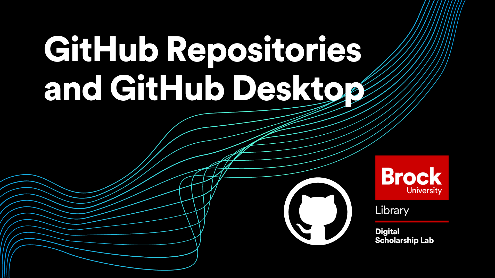

# Introduction to GitHub Repositories and GitHub Desktop

In this workshop, attendees will learn about one of the most useful and widely adopted platforms on the internet, GitHub.  GitHub is a very versatile tool, and this workshop covers its most basic function, as a free storage location for your data!  In addition, this workshop covers how to use GitHub Desktop and the basic project workflow.  This workshop is the first in the GitHub Workshop Series offered by the Brock University Digital Scholarship Lab.

No prior experience is needed to attend this workshop.  

*Estimated workshop length: 1.5 hours*

----

## Setup
In preparation for this workshop, you will need the following: 

 - A GitHub account which you can get by clicking the "Sign Up" button at the top right of [https://github.com/](https://github.com/).
 - GitHub Desktop which can be acquired at [https://desktop.github.com/](https://desktop.github.com/).  Keep in mind that if you are not using a personal computer for this workshop, you may need to contact your IT department for permission to install new software.
 - A file to upload to your new repository.  This can be anything from a blank text file to a picture.  Just keep in mind that it will be on a public repository so don't use anything inappropriate or sensitive.  

----

## Next Steps

After completing this workshop, the recommended next steps are:

 - Practice!  It is always beneficial to practice the steps learned to keep them fresh in your mind.  GitHub allows you to have unlimited repositories so explore any options that you are curious about!
 - Check out the other workshops in our introduction to GitHub Series
   - [Collaborating with Version Control on GitHub](https://brockdsl.github.io/Collaborating-with-Version-Control-on-GitHub/)
   - [Making a Free Webpage with GitHub Pages](https://brockdsl.github.io/Making-a-Free-Webpage-with-GitHub-Pages/)
   - [Automating tasks with GitHub Actions](https://brockdsl.github.io/Automating-tasks-with-GitHub-Actions/)
  
  
  
 
 ----

  
**This workshop is brought to you by the Brock University Digital Scholarship Lab.  For a listing of our upcoming workshops go to [Experience BU](https://experiencebu.brocku.ca/organization/dsl) if you are a Brock affiliate or [Eventbrite page](https://www.eventbrite.ca/o/brock-university-digital-scholarship-lab-21661627350) for external attendees.**

